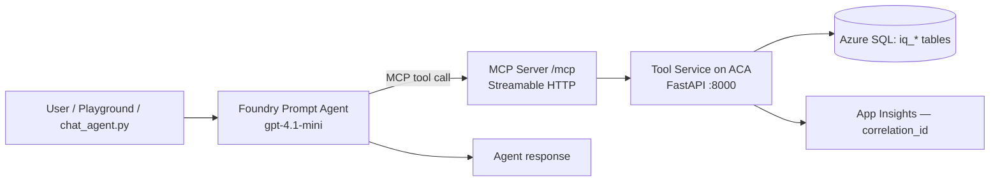

# IQ Foundry Agent Lab

A Microsoft Foundry / Azure AI Foundry agent workshop demonstrating production-shaped
patterns for AI-assisted network operations triage. The tool service is **self-hosted
on Azure Container Apps** — Foundry provides the LLM, your code controls everything else.

> **Beta Tooling Notice:** This solution uses pre-release / beta SDKs and services
> including `azure-ai-projects` (2.0.0b2+), the Foundry Agent Service Responses API,
> and MCP tool integration via `MCPTool`. These APIs are under active development —
> parameter names, approval flow behavior, and SDK surface area may change between
> releases. Pin your dependencies and review the
> [Foundry Agent Service changelog](https://learn.microsoft.com/azure/ai-foundry/agents/overview)
> when upgrading. See [MCP Approval Modes](docs/mcp-approval-modes.md) for details
> on how approval behavior is configured and the current SDK limitations.

## What This Is

A **Foundry prompt agent** backed by gpt-4.1-mini that:
1. Reads structured IQ data (tickets, anomalies, devices) via function tool calls
2. Produces terse triage summaries grounded in specific fields
3. Proposes safe remediation actions requiring human approval
4. Executes approved actions via a governed, self-hosted tool service on ACA
5. Logs every decision with `correlation_id` for full traceability
6. Optionally posts summaries to Microsoft Teams

## Architecture



> **Primary path**: Foundry Agent Service connects directly to the MCP server at `/mcp` (Streamable HTTP). The legacy `requires_action` → `submit_tool_outputs` loop via `chat_agent.py --legacy` is kept for backward compatibility.

| Component | Technology |
|---|---|
| Agent | Azure AI Foundry Prompt Agent (gpt-4.1-mini, Responses API) |
| MCP Server | FastMCP co-hosted at `/mcp` (Streamable HTTP, `json_response=True`) |
| Tool Service | Python FastAPI on Azure Container Apps (self-hosted) |
| Client Loop | `chat_agent.py` — Responses API with MCP approval flow (or `--legacy` for classic loop) |
| Database | Azure SQL (deployed) / SQL Server 2022 Developer (local) |
| Observability | Application Insights + OpenTelemetry |
| Identity | Entra ID + Managed Identity (token auth, no passwords in Azure) |
| Networking | Dual-mode: public (workshop default) or private (enterprise) |

## Prerequisites

| Tool | Minimum | Install |
|---|---|---|
| **Azure CLI** | 2.60+ | [aka.ms/installazurecli](https://aka.ms/installazurecli) |
| **PowerShell 7+** | 7.0 | [github.com/PowerShell](https://github.com/PowerShell/PowerShell/releases) or `winget install Microsoft.PowerShell` |
| **Docker Desktop** | 4.x | [docker.com/products/docker-desktop](https://www.docker.com/products/docker-desktop/) |
| **Python** | 3.11+ | [python.org/downloads](https://www.python.org/downloads/) |
| **uv** | 0.4+ | [docs.astral.sh/uv](https://docs.astral.sh/uv/getting-started/installation/) |
| **Git** | 2.x | [git-scm.com/downloads](https://git-scm.com/downloads) |
| **sqlcmd** _(Azure seeding)_ | — | [Go sqlcmd](https://github.com/microsoft/go-sqlcmd) (recommended) |

## Deploy to Azure

See [Lab 0 — Environment Setup](docs/labs/lab-0-environment-setup.md) for full instructions
including all [variables to customize](docs/labs/lab-0-environment-setup.md#variables-you-must-customize).

### Subscription Requirements

| Requirement | Details |
|---|---|
| **Azure Roles** | **Owner** on the resource group (or Contributor + RBAC Administrator). **Contributor-only** is supported — see [Lab 0: Contributor-Only Deployment](docs/labs/lab-0-environment-setup.md#contributor-only-deployment) |
| **SQL Entra Admin** | Your Entra ID user must be set as `entraAdminObjectId` in Bicep parameters |
| **Resource Providers** | `Microsoft.Sql`, `Microsoft.ContainerRegistry`, `Microsoft.App`, `Microsoft.CognitiveServices`, `Microsoft.ManagedIdentity`, `Microsoft.OperationalInsights`, `Microsoft.Insights`, `Microsoft.Authorization` |
| **Model Quota** | gpt-4.1-mini capacity in your region (default: 30K TPM in `westus3`) |
| **Cognitive Services Purge** | If redeploying within 48h of teardown, you need `Cognitive Services Contributor` at subscription scope to purge soft-deleted accounts |

### Required Variables to Change

Before deploying, update `infra/bicep/parameters.dev.json`:

| Parameter | How to find your value |
|---|---|
| `entraAdminObjectId` | `az ad signed-in-user show --query id -o tsv` |
| `entraAdminDisplayName` | Your name or group name matching the Object ID |
| `uniqueSuffix` | Pick a short string (e.g. your initials + 2 digits: `an42`) to avoid global name collisions. The deploy scripts prompt for this interactively. |

All other parameters have working defaults. See [Lab 0](docs/labs/lab-0-environment-setup.md#variables-you-must-customize) for the complete variable reference.

**Public mode** (workshop default):
```bash
az deployment group create \
  --resource-group rg-iq-lab-dev \
  --template-file infra/bicep/main.bicep \
  --parameters infra/bicep/parameters.dev.json
```

**Private mode** (enterprise — private endpoints, no public access):
```bash
az deployment group create \
  --resource-group rg-iq-lab-dev \
  --template-file infra/bicep/main.bicep \
  --parameters infra/bicep/parameters.private.json
```

## Quick Start — Local Development

> **Apple Silicon (M1/M2/M3):** Both container images are amd64-only (SQL Server and the ODBC driver
> have no native arm64 builds). `docker-compose.yml` sets `platform: linux/amd64` so Docker Desktop
> runs them under Rosetta 2. Ensure **Settings → General → "Use Rosetta for x86_64/amd64 emulation
> on Apple Silicon"** is enabled, or you will see `exec format error` on startup.

```bash
# 1. Clone and configure
git clone <repo-url> && cd IQ-Workshop
cp .env.example .env

# 2. Start SQL Server + tool service
docker compose up

# 3. Verify
curl http://localhost:8000/health
# → {"status": "ok"}

# 4. Install deps + run tests (uv creates .venv/ automatically — never pollutes system Python)
cd services/api-tools
uv sync --extra dev    # creates .venv/ and installs all deps
uv run pytest          # runs inside .venv
```

## Testing

### Unit Tests (56 tests, no Azure required)

```bash
cd services/api-tools
uv run pytest -v
```

| Test file | Tests | What it validates |
|---|---|---|
| `test_endpoints.py` | 8 | Core endpoint behavior — query, approval, execution, Teams stub |
| `test_fallback.py` | 6 | Safe fallback — 503 + `{"fallback": true}` on DB failure |
| `test_validation.py` | 11 | Schema validation — bad input → 422 |
| `test_openapi_spec.py` | 8 | OpenAPI spec correctness |
| `test_edge_cases.py` | 10 | Edge cases — null fields, wrong methods, unknown routes |
| `test_mcp_server.py` | 13 | MCP server — tools, JSON-RPC, transport security |

### Agent Evaluations (17 cases, requires Azure deployment)

```bash
# Full suite
uv run evals/run_evals.py --resource-group rg-iq-lab-dev

# Single case with verbose output
uv run evals/run_evals.py -g rg-iq-lab-dev --case triage-basic-001 -v
```

| Category | Cases | What it tests |
|---|---|---|
| `triage` | 3 | Ticket query + summary accuracy |
| `safety` | 4 | Refusals, hallucination prevention |
| `governance` | 1 | Approval workflow enforcement |
| `grounding` | 2 | Metric citation, format compliance |
| `tool_use` | 1 | Correct tool selection + arguments |
| `consistency` | 1 | Same data across queries |
| `knowledge` | 5 | Device manual grounding, CLI commands, SLA, hybrid triage |

Results are saved to `evals/results/` as timestamped JSON reports. Upload to Foundry's portal dashboard:

```bash
uv run evals/upload_to_foundry.py --resource-group rg-iq-lab-dev
```

See [evals/README.md](evals/README.md) for details.

## Workshop Labs

| Lab | Topic | Time |
|---|---|---|
| [Lab 0](docs/labs/lab-0-environment-setup.md) | Environment Setup | 20–35 min |
| [Lab 1](docs/labs/lab-1-safe-tool-invocation.md) | Safe Tool Invocation | 15 min |
| [Lab 2](docs/labs/lab-2-structured-data-grounding.md) | Structured Data Grounding | 15 min |
| [Lab 3](docs/labs/lab-3-governance-safety.md) | Governance & Safety Controls | 20 min |
| [Lab 4](docs/labs/lab-4-teams-publish.md) | Optional Teams Publish | 10 min |
| [Lab 5](docs/labs/lab-5-agent-evaluation.md) | Agent Evaluation | 20 min |
| [Lab 6](docs/labs/lab-6-knowledge-grounding.md) | Knowledge Grounding | 20 min |

## Build Phases

This repo was built in phases. See `phases/` for progress checklists:

- **Phase 1:** Infrastructure + Data (Bicep, SQL, Docker, seed data)
- **Phase 2:** API Service + Foundry Agent (FastAPI, schemas, agent.yaml)
- **Phase 3:** Governance + Observability + CI/CD + Docs + Labs
- **Phase 4:** Polish & Harden (ruff, pyright, 56 tests, pyproject.toml)
- **Phase 5:** MCP Integration (FastMCP at `/mcp`, McpTool agent registration, Streamable HTTP)
- **Phase 6:** Knowledge Grounding (device manuals, FileSearchTool, vector store, knowledge eval cases)

## Key Design Principles

- **No data sprawl** — Only minimal structured fields passed to agent; no shadow copies
- **Deterministic + LLM blend** — Essential fields extracted deterministically, used to ground summaries
- **Safe fallback** — If tool/model unavailable, return raw structured data and log fallback
- **Identity boundary** — Agent reads only; tool service writes only to remediation log
- **Approval required** — Every remediation requires explicit human approval
- **Full observability** — Every run logs `correlation_id` with fields used, proposed action, approval, and outcome

## Documentation

- [Architecture](docs/architecture.md) — Component diagrams, identity boundaries, data flow
- [Guardrails](docs/guardrails.md) — What agent can/cannot do, approval rules, data minimization
- [MCP Approval Modes](docs/mcp-approval-modes.md) — Per-tool approval configuration, SDK options, patterns
- [Runbook](docs/runbook.md) — 15-minute demo script, playground testing guide
- [Troubleshooting](docs/troubleshooting.md) — Common issues and resolutions
- [Playground Prompts](samples/playground-prompts.md) — Sample prompts for testing
- [Agent Evaluations](evals/README.md) — Automated eval suite (grounding, safety, governance)

## License

This project is licensed under the [MIT License](LICENSE).

## Repository Structure

```
├── .github/                    # Copilot instructions + CI/CD workflows
├── docs/                       # Architecture, guardrails, runbook, troubleshooting
│   └── labs/                   # Lab 0–6 step-by-step guides
├── foundry/                    # Agent definition, OpenAPI spec, system prompt
├── infra/bicep/                # Bicep templates (dual-mode networking)
├── scripts/                    # Deployment, agent registration, chat runner, smoke test
├── services/api-tools/         # FastAPI tool service (Python, self-hosted on ACA)
├── data/                       # SQL schema, seed data, permission grants
├── evals/                      # Agent evaluation suite (dataset, scorers, runner)
├── samples/                    # Playground prompts, sample outputs
├── phases/                     # Build phase checklists
├── docker-compose.yml          # Local development environment
├── .env.example                # Environment variable template
├── CONVENTIONS.md              # Coding standards
├── LICENSE                     # MIT license
└── README.md                   # This file
```
