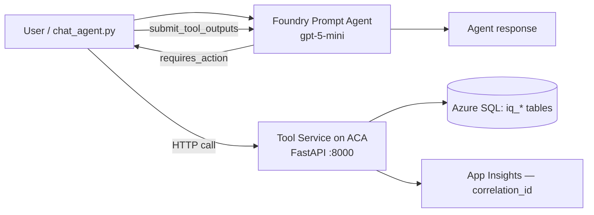

# IQ Foundry Agent Lab

A Microsoft Foundry / Azure AI Foundry agent workshop demonstrating production-shaped
patterns for AI-assisted network operations triage. The tool service is **self-hosted
on Azure Container Apps** — Foundry provides the LLM, your code controls everything else.

## What This Is

A **Foundry prompt agent** backed by gpt-5-mini that:
1. Reads structured IQ data (tickets, anomalies, devices) via function tool calls
2. Produces terse triage summaries grounded in specific fields
3. Proposes safe remediation actions requiring human approval
4. Executes approved actions via a governed, self-hosted tool service on ACA
5. Logs every decision with `correlation_id` for full traceability
6. Optionally posts summaries to Microsoft Teams

## Architecture



| Component | Technology |
|---|---|
| Agent | Azure AI Foundry Prompt Agent (gpt-5-mini, Responses API) |
| Tool Service | Python FastAPI on Azure Container Apps (self-hosted) |
| Client Loop | `chat_agent.py` — intercepts requires_action, calls tool service |
| Database | Azure SQL (deployed) / SQL Server 2022 Developer (local) |
| Observability | Application Insights + OpenTelemetry |
| Identity | Entra ID + Managed Identity (token auth, no passwords in Azure) |
| Networking | Dual-mode: public (workshop default) or private (enterprise) |

## Quick Start — Local Development

```bash
# 1. Clone and configure
git clone <repo-url> && cd IQ-Workshop
cp .env.example .env

# 2. Start SQL Server + tool service
docker compose up

# 3. Verify
curl http://localhost:8000/health
# → {"status": "ok"}

# 4. Install deps + run tests (uv only, never pip)
cd services/api-tools
uv sync --extra dev
uv run pytest
```

## Deploy to Azure

See [Lab 0 — Environment Setup](docs/labs/lab-0-environment-setup.md) for full instructions.

**Public mode** (workshop default):
```bash
az deployment group create \
  --resource-group rg-iq-agent-lab-dev \
  --template-file infra/bicep/main.bicep \
  --parameters infra/bicep/parameters.dev.json
```

**Private mode** (enterprise — private endpoints, no public access):
```bash
az deployment group create \
  --resource-group rg-iq-agent-lab-dev \
  --template-file infra/bicep/main.bicep \
  --parameters infra/bicep/parameters.private.json
```

## Workshop Labs

| Lab | Topic | Time |
|---|---|---|
| [Lab 0](docs/labs/lab-0-environment-setup.md) | Environment Setup | 20–35 min |
| [Lab 1](docs/labs/lab-1-safe-tool-invocation.md) | Safe Tool Invocation | 15 min |
| [Lab 2](docs/labs/lab-2-structured-data-grounding.md) | Structured Data Grounding | 15 min |
| [Lab 3](docs/labs/lab-3-governance-safety.md) | Governance & Safety Controls | 20 min |
| [Lab 4](docs/labs/lab-4-teams-publish.md) | Optional Teams Publish | 10 min |

## Build Phases

This repo was built in 3 phases. See `phases/` for progress checklists:

- **Phase 1:** Infrastructure + Data (Bicep, SQL, Docker, seed data)
- **Phase 2:** API Service + Foundry Agent (FastAPI, schemas, agent.yaml)
- **Phase 3:** Governance + Observability + CI/CD + Docs + Labs

## Key Design Principles

- **No data sprawl** — Only minimal structured fields passed to agent; no shadow copies
- **Deterministic + LLM blend** — Essential fields extracted deterministically, used to ground summaries
- **Safe fallback** — If tool/model unavailable, return raw structured data and log fallback
- **Identity boundary** — Agent reads only; tool service writes only to remediation log
- **Approval required** — Every remediation requires explicit human approval
- **Full observability** — Every run logs `correlation_id` with fields used, proposed action, approval, and outcome

## Documentation

- [Architecture](docs/architecture.md) — Component diagrams, identity boundaries, data flow
- [Guardrails](docs/guardrails.md) — What agent can/cannot do, approval rules, data minimization
- [Runbook](docs/runbook.md) — 15-minute demo script, playground testing guide
- [Troubleshooting](docs/troubleshooting.md) — Common issues and resolutions
- [Playground Prompts](samples/playground-prompts.md) — Sample prompts for testing

## License

This project is licensed under the [MIT License](LICENSE).

## Repository Structure

```
├── .github/                    # Copilot instructions + CI/CD workflows
├── docs/                       # Architecture, guardrails, runbook, troubleshooting
│   └── labs/                   # Lab 0–4 step-by-step guides
├── foundry/                    # Agent definition, OpenAPI spec, system prompt
├── infra/bicep/                # Bicep templates (dual-mode networking)
├── scripts/                    # Deployment, agent registration, chat runner, smoke test
├── services/api-tools/         # FastAPI tool service (Python, self-hosted on ACA)
├── data/                       # SQL schema, seed data, permission grants
├── samples/                    # Playground prompts, sample outputs
├── phases/                     # Build phase checklists
├── docker-compose.yml          # Local development environment
├── .env.example                # Environment variable template
├── CONVENTIONS.md              # Coding standards
├── LICENSE                     # MIT license
└── README.md                   # This file
```
