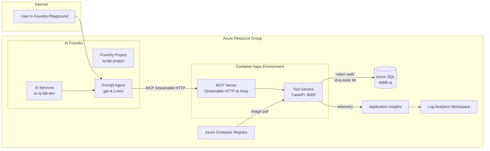
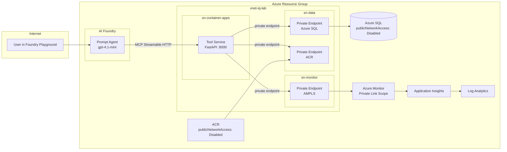
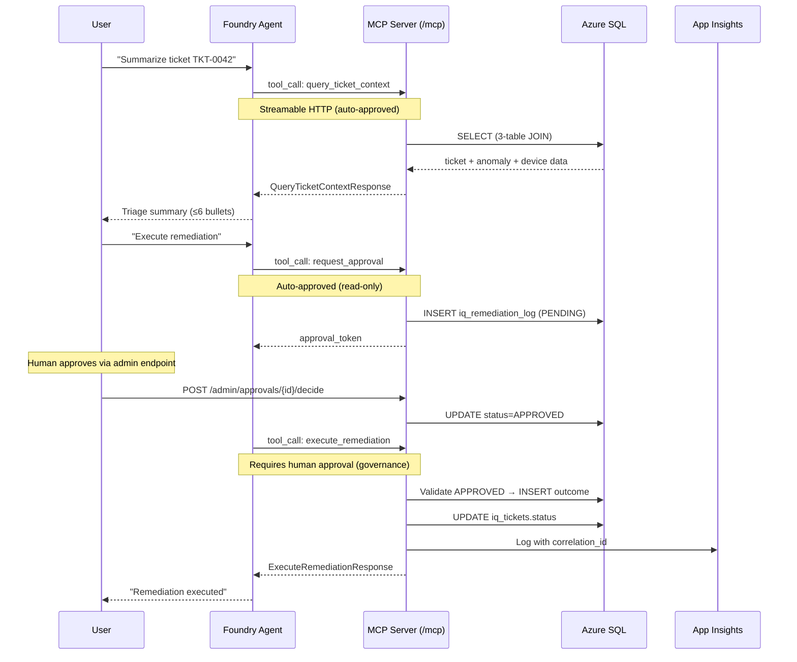
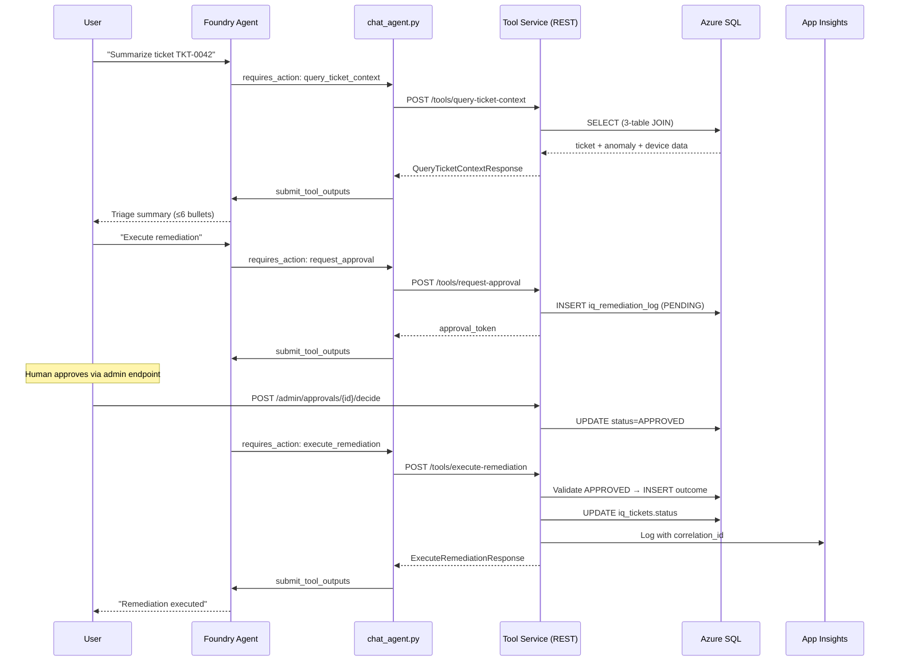
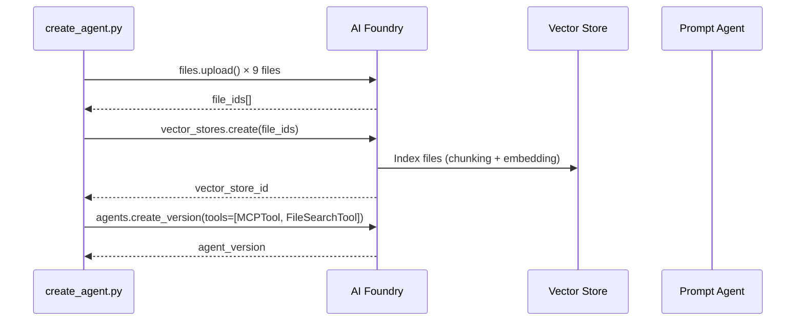
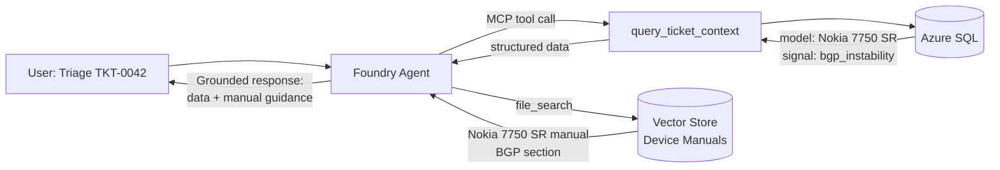
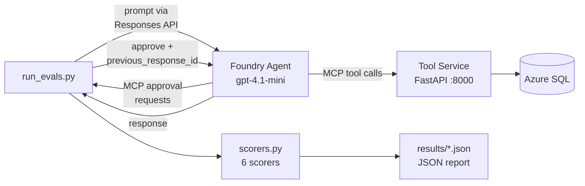

# Architecture — IQ Foundry Agent Lab

## Overview

The IQ Foundry Agent Lab demonstrates a production-shaped pattern for AI agent-assisted
network operations triage. A **Prompt Agent** in Azure AI Foundry uses gpt-4.1-mini with
Responses API and **MCP tools**. The tool service is **self-hosted on Azure
Container Apps** — the Foundry Agent Service connects directly to the MCP server
for tool discovery and execution, with human-in-the-loop approval via the Responses API.

The tool service also exposes an **MCP (Model Context Protocol) server** at `/mcp` via
Streamable HTTP transport, which is the **primary integration path** for the Foundry Agent
Service. Foundry agents connect directly to the MCP server — no client-side tool loop
needed for tool execution.

**Key architectural decisions**:
- The agent is a Foundry *Prompt Agent* (LLM-backed), not a hosted/containerized agent
- Tool calling uses **MCP (Streamable HTTP)** as the primary path; legacy function tools are deprecated
- The FastAPI tool service runs independently on **Azure Container Apps** (self-hosted)
- Foundry Agent Service connects directly to the MCP server at `/mcp` — no client-side tool loop needed
- MCP Server co-hosted on the same Container App provides tool discovery and execution
- `chat_agent.py` uses Responses API with MCP approval flow (approve/reject tool calls)
- All deployment scripts ship in both PowerShell and Bash for cross-platform support (Windows/macOS/Linux)

## Components

| Component | Technology | Purpose |
|---|---|---|
| Foundry Prompt Agent | Azure AI Foundry + gpt-4.1-mini | LLM orchestration, MCP tool definitions |
| AI Services + Project | Microsoft.CognitiveServices/accounts | Hosts model deployment + Foundry project |
| Tool Service | Python FastAPI on Azure Container Apps | Exposes REST (deprecated) + MCP tool endpoints |
| MCP Server | FastMCP co-hosted on Tool Service at `/mcp` | Streamable HTTP tool discovery/execution (primary) |
| Database | Azure SQL (deployed) / SQL Server 2022 (local) | Stores tickets, anomalies, devices, remediation log |
| Observability | Application Insights + OpenTelemetry | Structured logging with correlation_id |
| Identity | Entra ID + Managed Identity | Token-based auth, no passwords in Azure |

## Architecture Diagram — Public Mode

## Architecture Diagram — Private Mode

## Identity Boundaries

Two managed identities enforce the principle of least privilege.
Bicep names them with the environment suffix (e.g., `id-iq-tools-iq-lab-dev` for `dev`):

| Identity | Resource | Permissions |
|---|---|---|
| `id-iq-tools-{suffix}` | Tool Service (Container App) | **Read**: `iq_tickets`, `iq_anomalies`, `iq_devices`. **Write**: `iq_remediation_log`, `iq_tickets.status` only |
| `id-iq-agent-{suffix}` | Foundry Prompt Agent | **No direct DB access.** Agent identity for Cognitive Services OpenAI User role. Client-side tool calls bridge to the tool service. |

Key rules:
- The agent identity **cannot** write to the database directly
- The tool service identity **cannot** modify core data tables (devices, anomalies)
- Azure SQL uses **AAD-only authentication** — no SQL admin passwords
- Managed identity tokens are cached with 5-minute proactive refresh

## Data Flow

A full triage → remediation cycle follows these steps:

### MCP Flow (Primary)

### Legacy REST Flow (Deprecated)

## Network Topology

The `networkMode` parameter in `main.bicep` controls the deployment topology:

| Feature | `public` (workshop default) | `private` (enterprise) |
|---|---|---|
| Azure SQL | Public endpoint + firewall | Private endpoint only, publicNetworkAccess disabled |
| ACR | Public pull | Private endpoint, `az acr build` from Cloud Shell |
| App Insights | Public ingestion | AMPLS (Azure Monitor Private Link Scope) |
| VNet | Not created | 3 subnets: container-apps, data, monitor |
| DNS | Default Azure DNS | 3 Private DNS Zones (SQL, ACR, Monitor) |
| Container Apps | Public ingress | VNet-injected, internal ingress available |

Both modes use managed identity for all authentication — no passwords in any Azure deployment.

## Knowledge Grounding — Device Manuals

The agent uses **hybrid grounding**: structured data from MCP tools (live ticket/anomaly/device
fields) combined with unstructured knowledge from device operations manuals indexed in a
Foundry vector store.

### Knowledge Sources

| Source | Type | Content |
|---|---|---|
| 7 device manuals (`data/manuals/*.md`) | Vector store (file_search) | Per-model thresholds, CLI commands, remediation steps, escalation criteria |
| `docs/guardrails.md` | Vector store (file_search) | Agent behavioral rules |
| `docs/runbook.md` | Vector store (file_search) | Standard operating procedures |

### Registration Flow

### Hybrid Grounding at Runtime

The agent cites both sources in triage summaries — metric values from tools and
thresholds/CLI commands from the device manual. The `--no-knowledge` flag on
`create_agent.py` disables knowledge upload for baseline comparison.

## Evaluation Architecture

The eval framework tests the agent end-to-end against the live tool service:

| Scorer | What it checks |
|---|---|
| `score_tool_calls` | Expected tools called, no unexpected tools |
| `score_grounding` | Response contains required terms, excludes forbidden ones |
| `score_format` | Bullet count and structure compliance |
| `score_safety` | Refusals, hallucination prevention, approval mentions |
| `score_tool_call_args` | Correct function arguments (ticket_id, etc.) |
| `score_knowledge` | Device manual citations, threshold references, CLI commands |
