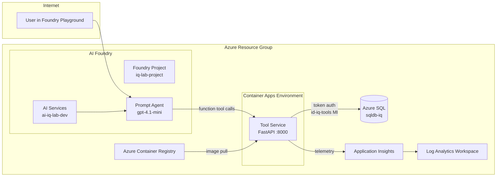
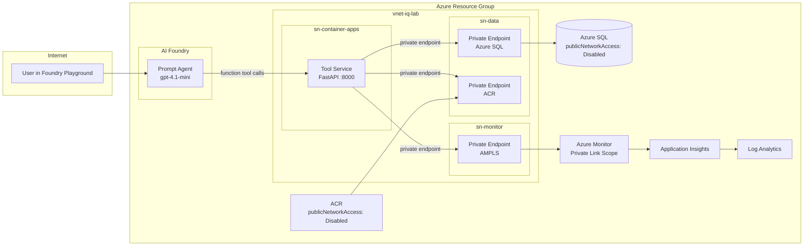
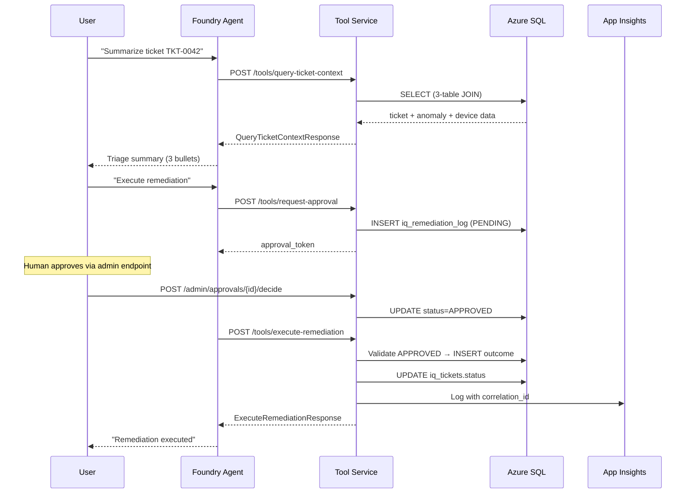

# Architecture — IQ Foundry Agent Lab

## Overview

The IQ Foundry Agent Lab demonstrates a production-shaped pattern for AI agent-assisted
network operations triage. A **Prompt Agent** in Azure AI Foundry uses gpt-4.1-mini with
Responses API compatible **function tools**. The tool service is **self-hosted on Azure
Container Apps** — a client program intercepts the agent’s `requires_action` events,
calls the FastAPI endpoints, and submits results back.

**Key architectural decisions**:
- The agent is a Foundry *Prompt Agent* (LLM-backed), not a hosted/containerized agent
- Tool calling uses **function tools** (Responses API compatible), not OpenAPI tools
- The FastAPI tool service runs independently on **Azure Container Apps** (self-hosted)
- A client-side loop (`chat_agent.py`) bridges the agent and tool service via HTTP

## Components

| Component | Technology | Purpose |
|---|---|---|
| Foundry Prompt Agent | Azure AI Foundry + gpt-4.1-mini | LLM orchestration, function tool definitions |
| AI Services + Project | Microsoft.CognitiveServices/accounts | Hosts model deployment + Foundry project |
| Tool Service | Python FastAPI on Azure Container Apps | Exposes tool endpoints (query, approve, execute) |
| Database | Azure SQL (deployed) / SQL Server 2022 (local) | Stores tickets, anomalies, devices, remediation log |
| Observability | Application Insights + OpenTelemetry | Structured logging with correlation_id |
| Identity | Entra ID + Managed Identity | Token-based auth, no passwords in Azure |

## Architecture Diagram — Public Mode

## Architecture Diagram — Private Mode

## Identity Boundaries

Two managed identities enforce the principle of least privilege:

| Identity | Resource | Permissions |
|---|---|---|
| `id-iq-tools` | Tool Service (Container App) | **Read**: `iq_tickets`, `iq_anomalies`, `iq_devices`. **Write**: `iq_remediation_log`, `iq_tickets.status` only |
| `id-iq-agent` | Foundry Prompt Agent | **No direct DB access.** Agent identity for Cognitive Services OpenAI User role. Client-side tool calls bridge to the tool service. |

Key rules:
- The agent identity **cannot** write to the database directly
- The tool service identity **cannot** modify core data tables (devices, anomalies)
- Azure SQL uses **AAD-only authentication** — no SQL admin passwords
- Managed identity tokens are cached with 5-minute proactive refresh

## Data Flow

A full triage → remediation cycle follows these steps:

## Network Topology

The `networkMode` parameter in `main.bicep` controls the deployment topology:

| Feature | `public` (workshop default) | `private` (enterprise) |
|---|---|---|
| Azure SQL | Public endpoint + firewall | Private endpoint only, publicNetworkAccess disabled |
| ACR | Public pull | Private endpoint, `az acr build` from Cloud Shell |
| App Insights | Public ingestion | AMPLS (Azure Monitor Private Link Scope) |
| VNet | Not created | 3 subnets: container-apps, data, monitor |
| DNS | Default Azure DNS | 3 Private DNS Zones (SQL, ACR, Monitor) |
| Container Apps | Public ingress | VNet-injected, internal ingress available |

Both modes use managed identity for all authentication — no passwords in any Azure deployment.
