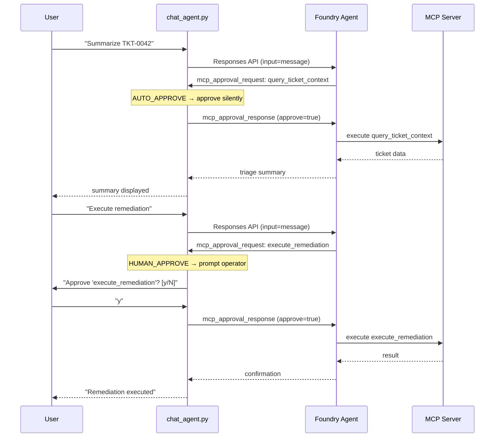

# MCP Tool Approval Modes

## Overview

When a Foundry Prompt Agent uses MCP tools, every tool call can be gated by an
**approval flow** — the agent pauses and asks the client to approve or reject
the call before the MCP server executes it. This enables human-in-the-loop
governance for mutating operations while letting safe, read-only tools execute
without friction.

This document explains how the approval system works, what configuration options
exist at the SDK level, and how this project implements **targeted per-tool
approval** using a client-side policy.

---

## SDK-Level Configuration

The `MCPTool` class in `azure-ai-projects` accepts a **server-wide**
`require_approval` setting when registering the MCP server with the agent:

```python
from azure.ai.projects.models import MCPTool

mcp_tool = MCPTool(
    server_label="iq-tools",
    server_url="https://<container-app>/mcp",
    require_approval="always",   # <-- server-wide setting
)
```

| `require_approval` | Behavior |
|---|---|
| `"always"` | Every tool call from this server surfaces as an approval request to the client |
| `"never"` | All calls execute without approval |
| *(omitted)* | Defaults to `"never"` |

> **Important:** There is no per-tool `require_approval` field in the SDK as of
> `azure-ai-projects>=2.0.0b2`. The setting applies to **all tools** exposed by
> the MCP server. Per-tool targeting must be implemented at the client level or
> via multiple `MCPTool` registrations (see patterns below).

---

## Pattern 1: Client-Side Policy (Recommended)

Set `require_approval="always"` on the single MCP server registration, then
implement a **tool-name policy map** in the chat client. The client auto-approves
safe tools and prompts the operator only for dangerous ones.

### How it works in this project

**Agent registration** (`scripts/create_agent.py`):

```python
mcp_tool = MCPTool(
    server_label="iq-tools",
    server_url=f"{tool_service_url}/mcp",
    require_approval="always",       # all tools surface for approval
)
tools = [mcp_tool]
```

**Client-side policy** (`scripts/chat_agent.py`):

```python
# Read-only / safe tools — approved automatically
AUTO_APPROVE_TOOLS = {"query_ticket_context", "request_approval", "post_teams_summary"}

# Mutating tools — require human confirmation
HUMAN_APPROVE_TOOLS = {"execute_remediation"}
```

**Approval loop** (simplified):

```python
for item in response.output:
    if item.type == "mcp_approval_request":
        if item.name in AUTO_APPROVE_TOOLS:
            approved = True                          # silent pass-through
        elif item.name in HUMAN_APPROVE_TOOLS:
            approved = input("Approve? [y/N] ")      # operator prompt
        else:
            approved = False                          # unknown → reject

        approval_inputs.append(
            McpApprovalResponse(
                type="mcp_approval_response",
                approve=approved,
                approval_request_id=item.id,
            )
        )
```

### Advantages

- **Flexible** — change the approval policy without redeploying or re-registering
  the agent.
- **Safe by default** — unknown tools are rejected, so adding a new tool to the
  MCP server doesn't automatically grant it unsupervised access.
- **Visible** — the entire governance policy is in one place
  (`AUTO_APPROVE_TOOLS` / `HUMAN_APPROVE_TOOLS` constants).
- **No SDK dependency** — works with any `require_approval` setting and any SDK
  version that supports MCP approval requests.

### Sequence Diagram



---

## Pattern 2: Multiple MCPTool Registrations

Register the **same MCP server** twice under different labels, each with a
different `require_approval` setting and an `allowed_tools` filter:

```python
# Safe tools — no approval needed
safe_mcp = MCPTool(
    server_label="iq-tools-safe",
    server_url=f"{tool_service_url}/mcp",
    require_approval="never",
    allowed_tools=["query_ticket_context", "request_approval", "post_teams_summary"],
)

# Dangerous tools — always require approval
dangerous_mcp = MCPTool(
    server_label="iq-tools-dangerous",
    server_url=f"{tool_service_url}/mcp",
    require_approval="always",
    allowed_tools=["execute_remediation"],
)

tools = [safe_mcp, dangerous_mcp]
```

### Advantages

- Approval policy is enforced at the **server registration level** — the client
  doesn't need custom logic.
- Works with the Foundry Playground UI (which doesn't have a custom approval
  loop).

### Caveats

- **`allowed_tools` availability** — this parameter depends on SDK version.
  Verify support in your version of `azure-ai-projects` before using this
  pattern.
- **Less flexible** — changing the policy requires re-registering the agent.
- **Duplicated server connection** — the agent maintains two logical connections
  to the same physical MCP server.

---

## Tool Classification in This Project

| Tool | Type | Risk | Approval Mode |
|---|---|---|---|
| `query_ticket_context` | Read-only | Low | Auto-approved |
| `request_approval` | Read + write (creates PENDING record) | Low | Auto-approved |
| `post_teams_summary` | Side-effect (webhook) | Low | Auto-approved |
| `execute_remediation` | Write (mutates DB state) | **High** | **Human approval required** |

The `execute_remediation` tool is the only one that mutates production state
(writes to `iq_remediation_log`, updates `iq_tickets.status`). It also enforces
a **server-side approval gate** — even if the client approves the MCP call, the
tool service validates that the `approval_token` has status `APPROVED` in the
database before executing. This provides **defense in depth**: both the client
and the server independently enforce the governance policy.

---

## Configuration Reference

### Agent registration (`scripts/create_agent.py`)

| Setting | Value | Purpose |
|---|---|---|
| `server_label` | `"iq-tools"` | Logical name for the MCP server |
| `server_url` | `"${TOOL_SERVICE_URL}/mcp"` | MCP endpoint (Streamable HTTP) |
| `require_approval` | `"always"` | All tools surface for client approval |

### Client policy (`scripts/chat_agent.py`)

| Constant | Tools | Action |
|---|---|---|
| `AUTO_APPROVE_TOOLS` | `query_ticket_context`, `request_approval`, `post_teams_summary` | Approve silently |
| `HUMAN_APPROVE_TOOLS` | `execute_remediation` | Prompt operator |
| *(unknown)* | Any tool not in either set | Reject |

### Agent definition (`foundry/agent.yaml`)

```yaml
mcp:
  server_label: iq-tools
  server_url: "${TOOL_SERVICE_URL}/mcp"
  require_approval: always
```

---

## Adding a New Tool

When adding a new MCP tool to the server (`app/mcp_server.py`):

1. **Classify the tool** — is it read-only, side-effect, or write/mutating?
2. **Add it to the correct set** in `scripts/chat_agent.py`:
   - Read-only → add to `AUTO_APPROVE_TOOLS`
   - Mutating → add to `HUMAN_APPROVE_TOOLS`
   - If unsure → leave it out of both sets (unknown tools are rejected by default)
3. **Update `foundry/agent.yaml`** — add the tool to the `mcp.tools` list
4. **Update tests** — add eval cases for the new tool's approval behavior

> **Default-deny principle:** A new tool that is NOT listed in either
> `AUTO_APPROVE_TOOLS` or `HUMAN_APPROVE_TOOLS` will be **rejected** by the
> client. This ensures new tools don't silently gain unsupervised access.
