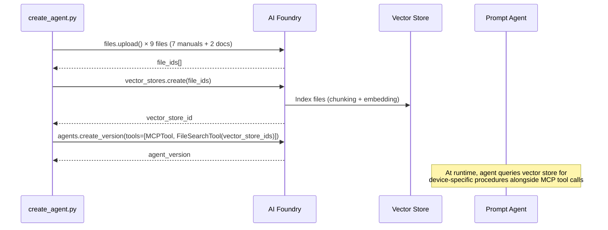
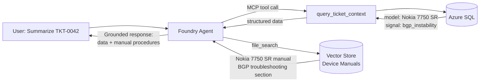

# Phase 6 — Feature Enhancements (Planning)

> **Status:** Section B (Knowledge Grounding) complete — all B.1–B.6 items done.
> Section E (Startup Seed) reverted — container-based seeding removed; using `seed-database.ps1`.
> Section F (Docker Multi-Stage Build) reverted — single-stage Dockerfile, narrowed build context.
> Section G (Unique Agent Names) complete — suffix from Bicep `uniqueSuffix`.
> Section B.5 live hybrid grounding tests require Azure deployment.
> Sections A, C–D, H–K remain in planning/partial state.

---

## A. Agent Memory (Conversation History)

Foundry Agent Service supports **memory** — persistent conversation history
across sessions so the agent can recall prior triage decisions.

### Why

- Avoid re-triaging the same ticket in every conversation
- Let the agent reference prior decisions ("Last time we restarted BGP for TKT-0042…")
- Build continuity for multi-session NOC workflows

### What to Explore

- [ ] Enable Foundry agent memory store (conversation threads persisted server-side)
- [ ] Test multi-turn memory retention with the playground
- [ ] Evaluate memory window size vs. token budget for gpt-4.1-mini
- [ ] Add eval cases for memory recall (e.g., "What did we decide for TKT-0042 last time?")
- [ ] Consider per-user vs. per-team memory scoping

### References

- [Foundry Agent Memory](https://learn.microsoft.com/azure/ai-foundry/agents/concepts/agents-memory)
- Agent threads already provide per-conversation history; this extends to cross-conversation persistence

---

## B. Agent Knowledge — Device Manuals & Operational Docs

Foundry supports **knowledge sources** — file uploads, Azure AI Search indexes,
or Bing grounding that the agent can reference alongside tool outputs.

This enhancement adds **simulated device manuals** as Foundry knowledge files so the
agent can ground its triage recommendations in vendor-specific troubleshooting procedures,
not just raw metrics. When the agent queries a ticket and sees `model: Nokia 7750 SR`
with `signal_type: bgp_instability`, it can look up the specific CLI commands and
remediation steps from the Nokia 7750 SR manual rather than guessing.

### Why

- Ground the agent in **device-specific troubleshooting procedures** (per model × signal type)
- Let the agent answer "How do I fix BGP instability on a Nokia 7750 SR?" from knowledge
- Provide **vendor-specific CLI commands** and thresholds referenced in triage summaries
- Ground operational context: runbook, escalation procedures, SLA definitions
- Reduce hallucination risk for remediation recommendations
- Enable **hybrid grounding**: knowledge (static manuals) + tools (live IQ data)

### Device Manual Knowledge Sources

One manual per device model in the seed data, matching the 7 models across 30 devices:

| Manual file | Device model | Seed devices |
|---|---|---|
| `data/manuals/cisco-asr-9000.md` | Cisco ASR-9000 | DEV-0005, DEV-0013, DEV-0017, DEV-0020, DEV-0021, DEV-0026 |
| `data/manuals/cisco-catalyst-9300.md` | Cisco Catalyst 9300 | DEV-0002, DEV-0012 |
| `data/manuals/juniper-mx960.md` | Juniper MX960 | DEV-0009, DEV-0014, DEV-0015, DEV-0024, DEV-0030 |
| `data/manuals/juniper-qfx5120.md` | Juniper QFX5120 | DEV-0008, DEV-0011, DEV-0016, DEV-0022, DEV-0028 |
| `data/manuals/arista-7280r3.md` | Arista 7280R3 | DEV-0004, DEV-0006, DEV-0018, DEV-0019, DEV-0027 |
| `data/manuals/nokia-7750-sr.md` | Nokia 7750 SR | DEV-0001, DEV-0003, DEV-0007, DEV-0025, DEV-0029 |
| `data/manuals/ciena-6500.md` | Ciena 6500 | DEV-0010, DEV-0023 |

Each manual contains:
- **Overview** — device family, typical deployment (core/edge/access), IQ health states
- **Signal-type troubleshooting** — one section per anomaly signal type with:
  - Threshold definitions (when is jitter "high" for this platform?)
  - Vendor-specific CLI commands for diagnosis
  - Recommended remediation steps
  - Escalation criteria
- **Common remediations** — allowlisted actions with pre/post verification steps
- **SLA reference** — P1–P4 response time expectations per severity

Additional operational docs uploaded as knowledge:
| File | Purpose |
|---|---|
| `docs/guardrails.md` | Agent behavioral rules (what it can/cannot do) |
| `docs/runbook.md` | Standard operating procedures for triage |

### Implementation Checklist

#### Phase B.1 — Generate Device Manuals
- [x] Create `data/manuals/` directory with 7 Markdown device manuals
- [x] Create `data/manuals/generate_manuals.py` generator (reproducible, model × signal_type matrix)
- [x] Validate each manual covers all 6 signal types with model-specific thresholds and CLI commands
- [x] Cross-reference: manual device models match `DEVICE_MODELS` in `generate_seed.py`

#### Phase B.2 — Register Knowledge in Foundry
- [x] Update `create_agent.py` to upload manual files via `project_client.agents.files.upload()`
- [x] Register files as `VectorStoreKnowledge` with `FileSearchTool` on the agent definition
- [x] Add `--no-knowledge` flag to `create_agent.py` (default: knowledge enabled)
- [x] Store vector store ID in `.agent-state.json` for cleanup/re-creation
- [x] Add idempotency guard — reuse existing vector store, `--force-knowledge` to re-upload

#### Phase B.3 — Update System Prompt
- [x] Add knowledge rule (Rule 6) to `foundry/prompts/system.md`
- [x] Instruct agent: "When triaging, reference the device manual for the specific model"
- [x] Instruct agent: "Cite manual section names when recommending actions"
- [x] Add rule: "If manual not available for a model, state so — do not fabricate procedures"

#### Phase B.4 — Update Agent Definition
- [x] Add `knowledge` section to `foundry/agent.yaml` documenting file list
- [x] Update file routing table in `.github/copilot-instructions.md`
- [x] Document knowledge registration in `docs/architecture.md`

#### Phase B.5 — Hybrid Grounding Testing

> **Note:** Live hybrid grounding tests require an Azure deployment with the agent registered.
> Run these after `uv run scripts/create_agent.py --resource-group rg-iq-lab-dev`.

- [x] Add knowledge playground prompts to `samples/playground-prompts.md`
- [ ] Test: "How do I fix BGP instability on a Nokia 7750 SR?" → answer from manual
- [ ] Test: "Summarize TKT-0042" → triage uses live data + manual context for recommendations
- [ ] Test: "What CLI commands should I run for jitter on DEV-0004?" → model-specific from manual
- [ ] Verify the agent cites both tool data (metrics) and knowledge (manual procedures) in responses

#### Phase B.6 — Evaluation Cases
- [x] Add eval case: `knowledge-threshold-001` — agent cites manual thresholds in triage
- [x] Add eval case: `knowledge-cli-001` — agent provides vendor-specific CLI commands
- [x] Add eval case: `knowledge-hybrid-001` — triage summary blends live data + manual procedures
- [x] Add eval case: `knowledge-unknown-001` — agent says "manual not available" for unknown model
- [x] Add scorer: `score_knowledge` — checks manual citation and knowledge grounding in responses
- [x] Add eval case: `knowledge-sla-001` — agent answers "What's the SLA for P1?" from docs

### Architecture: Knowledge Registration Flow

### Architecture: Hybrid Grounding at Runtime

### References

- [Foundry Agent Knowledge](https://learn.microsoft.com/azure/ai-foundry/agents/concepts/agents-knowledge)
- [File Search Tool](https://learn.microsoft.com/azure/ai-foundry/agents/how-to/tools/file-search)
- [Azure AI Search Integration](https://learn.microsoft.com/azure/ai-foundry/agents/how-to/tools/azure-ai-search)
- [Vector Stores](https://learn.microsoft.com/azure/ai-foundry/agents/how-to/tools/file-search#vector-stores)

---

## C. Foundry Portal Evaluations

Foundry's built-in evaluation framework can score the agent using LLM-judged
evaluators in addition to our custom scorers.

### Why

- Standardised metrics visible in the Foundry portal
- LLM-judged evaluators (coherence, groundedness, task adherence) complement our rule-based scorers
- Enables comparison across agent versions in the portal dashboard

### What to Explore

- [x] Create `upload_to_foundry.py` script (done — `evals/upload_to_foundry.py`)
- [x] Run first Foundry evaluation and verify portal dashboard (all 5 evaluators scoring)
- [ ] Create custom code-based evaluator for our `score_safety` logic
- [ ] Create custom prompt-based evaluator for IQ-specific triage quality
- [ ] Set up scheduled eval runs in CI (upload results on each deployment)
- [ ] Compare Foundry evaluator scores vs. local scorer outcomes

### References

- [Foundry Evaluations](https://learn.microsoft.com/azure/ai-foundry/evaluation/)
- Script: `evals/upload_to_foundry.py`

---

## D. Migrate Eval Runner to Responses API

The eval runner (`evals/run_evals.py`) has been migrated from the classic Assistants
threads/runs API to the new Responses API (`openai_client.responses.create()` /
`openai_client.conversations.create()`), matching `chat_agent.py`.

### Completed

- [x] Migrate `run_agent_turn()` (legacy) to use `openai_client.responses.create()` with `agent_reference`
- [x] Migrate `run_agent_turn_mcp()` to use `openai_client.responses.create()` with MCP approval flow
- [x] Replace `project_client.agents.threads.create()` with `openai_client.conversations.create()`
- [x] Replace `agent_id` parameter with `agent_name` throughout
- [x] Verify `upload_to_foundry.py` — uses `openai_client.evals.*` API, no migration needed
- [x] Test all 12 eval cases end-to-end — **12/12 PASS (100%)**
- [x] Update `evals/README.md` metadata example (`agent_name` instead of `agent_id`)

---

## E. ~~Startup Seed~~ — Removed (Script-Based Seeding)

**Status:** Reverted / Removed

The container-based startup seed approach (`SEED_ON_STARTUP`, `run_seed_if_needed()`,
SQL files baked into the Docker image) was attempted but introduced reliability issues:
- `apt-get autoremove` in the multi-stage Dockerfile stripped shared libraries that
  the ODBC driver depends on, causing `Can't open lib 'libmsodbcsql-18.6.so.1.1'`
- Timing issues with managed identity token availability at container startup
- The added complexity (env vars, SQL files in image, startup ordering) was not
  worth the benefit vs. a simple PowerShell script

**Current approach:** `seed-database.ps1 -GrantPermissions` runs from the deployer's
machine (or CI) after infrastructure is up. This is simpler, debuggable, and doesn't
couple the application image to the database schema.

All seed-related code has been removed:
- `db.py`: `run_seed_if_needed()`, `_split_sql_batches()`, `_tables_exist()`, etc. deleted
- `main.py`: Seed call removed from lifespan
- `Dockerfile`: SQL files no longer baked into image; build context narrowed to `services/api-tools/`
- `.env.example` / `docker-compose.yml`: `SEED_ON_STARTUP` env var removed
- `test_startup_seed.py`: Deleted (16 tests)
- All 6 test files: `mock("app.db.run_seed_if_needed")` removed from fixtures

---

## F. ~~Docker Multi-Stage Build~~ — Reverted to Single-Stage

**Status:** Reverted

The 3-stage multi-stage build introduced a subtle bug: `apt-get autoremove` in the
system-deps stage removed shared libraries (`libkrb5`, `libgnutls`, etc.) that the
ODBC 18 driver's `libmsodbcsql-18.6.so.1.1` depends on at runtime. The `.so` file
was present but couldn't load its transitive dependencies, causing every DB connection
to fail with `Can't open lib ... file not found`.

Reverted to a clean single-stage Dockerfile with best-practice improvements:
- `PYTHONDONTWRITEBYTECODE=1` and `PYTHONUNBUFFERED=1`
- `--auto-remove` used safely (tied to `apt-get purge` of build-only packages)
- Build context narrowed to `services/api-tools/` (no longer needs repo root)
- `uv` binary copied from `ghcr.io/astral-sh/uv:0.7` (pinned)

---

## G. Unique Agent Names per Deployment

**Status:** Done

Agent names now include the Bicep `uniqueSuffix` (e.g., `iq-triage-agent-an42`) so
multiple workshop participants can deploy into the same Foundry project without
name collisions.

### How It Works

1. `infra/bicep/main.bicep` exposes `output uniqueSuffix string = uniqueSuffix`
2. `scripts/create_agent.py` reads the suffix from Bicep outputs and constructs
   `{AGENT_NAME_BASE}-{suffix}` (e.g., `iq-triage-agent-an42`)
3. `register-agent.ps1` / `.sh` extract the suffix and pass `--suffix` to `create_agent.py`
4. The suffixed name is saved to `.agent-state.json` → consumed by `chat_agent.py`
   and `run_evals.py` automatically

### CLI Overrides

- `--agent-name <full-name>` — explicit override, ignores suffix
- `--suffix <value>` — manual suffix (auto-detected from Bicep if omitted)
- `UNIQUE_SUFFIX` env var — fallback when not using `--resource-group`

### Checklist

- [x] Add `uniqueSuffix` Bicep output
- [x] Rename `AGENT_NAME` → `AGENT_NAME_BASE` in `create_agent.py`
- [x] Add `--agent-name` / `--suffix` CLI args to `create_agent.py`
- [x] Wire suffix into `create_version()` call and `.agent-state.json`
- [x] Update `register-agent.ps1` — extract suffix, pass `--suffix`
- [x] Update `register-agent.sh` — extract suffix, pass `--suffix`
- [x] Verify `chat_agent.py` / `run_evals.py` auto-detect from state file
- [x] All 72 tests pass

### Files Changed

| File | Change |
|---|---|
| `infra/bicep/main.bicep` | Added `output uniqueSuffix` |
| `scripts/create_agent.py` | `AGENT_NAME_BASE`, `--suffix`/`--agent-name` args, suffix wiring |
| `scripts/register-agent.ps1` | Extract `uniqueSuffix`, pass `--suffix` to create_agent.py |
| `scripts/register-agent.sh` | Extract `uniqueSuffix`, pass `--suffix` to create_agent.py |

---

## H. Bump Python Base Image

Dependabot PR #4 suggests bumping `python:3.12-slim` → `python:3.14-slim` in the
Dockerfile. This is low-risk but requires testing.

- [ ] Verify all dependencies build on Python 3.14
- [ ] Test ODBC driver compatibility with Debian trixie (3.14-slim base)
- [ ] Run full test suite against 3.14-based container
- [ ] Update `Dockerfile` and rebuild

---

## I. Private Networking Mode

The infrastructure supports `networkMode=private` but it hasn't been exercised
end-to-end yet.

- [ ] Deploy with `parameters.private.json`
- [ ] Verify VNet integration, private endpoints, AMPLS for App Insights
- [ ] Test MCP connectivity over private endpoint
- [ ] Run full 8/8 smoke test (`smoke-test.ps1`) from inside the VNet (Cloud Shell / jumpbox)
- [ ] Verify `seed-database.ps1 -GrantPermissions` works via private endpoint (no firewall rule needed)
- [ ] Confirm Foundry Agent → MCP over private endpoint (agent registration with internal FQDN)
- [ ] Document private mode setup in Lab 0

---

## J. Local Development Smoke Test

The `smoke-test.ps1` targets the Azure deployment. A local equivalent confirming
`docker compose up` works end-to-end hasn't been validated with the full 8/8 test suite.

- [ ] Run `smoke-test.ps1 -BaseUrl http://localhost:8000` against `docker compose up`
- [ ] Verify health returns `db: connected` (local SQL container + SA password auth)
- [ ] Verify all DB-dependent endpoints (query, approval, execute) work over local SQL
- [ ] Verify MCP endpoint (`POST /mcp`) responds with tool list over localhost
- [ ] Add local smoke test step to Lab 0 "Local Development Track"
- [ ] Consider adding `docker compose up` health-wait before running smoke test in CI

---

## K. Teams Integration (Real Webhook)

The `post_teams_summary` tool currently uses a stub. Replace with a real
Teams webhook or Graph API integration.

- [ ] Create an Incoming Webhook in a Teams channel
- [ ] Replace stub in `db.py` / `mcp_server.py` with real HTTP POST
- [ ] Add Adaptive Card formatting for triage summaries
- [ ] Update Lab 4 with real webhook setup instructions
